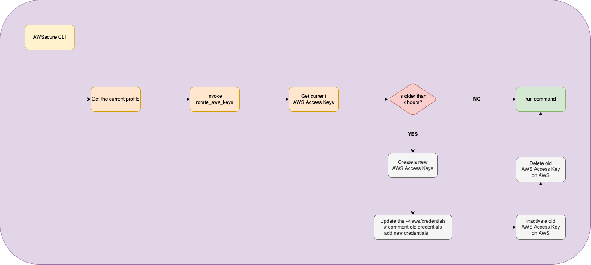

# AWSecure CLI

**Security is an important topic, so why not facilitate the adoption of good security practices?**

Enabling, in the client-side, the AWS Access Keys auto-rotation, based on user definition (e.g. 168 hours) and also MFA for each request made by the AWS CLI.

This tool also integrates with `kubectl`, so it will add one more security layer when dealing with Amazon EKS objects.

_Hoping these will become a native features_

**NEVER EVER SHARE YOUR ACCOUNT ID (OR ALIAS), USERNAME, AND ACCESS KEYS**


## Video demo

<a href="https://www.youtube.com/watch?v=E8blMxdl0Ao" title="AWSecure CLI">
  <p align="center">
    
  </p>
</a>

---

## Pre-requirements

* [bash](https://tiswww.case.edu/php/chet/bash/bashtop.html) or [zsh](https://zsh.sourceforge.io/)
* [jq](https://stedolan.github.io/jq/)
* [AWS CLI](https://aws.amazon.com/cli/)
* [realpath](https://github.com/coreutils/coreutils)

## AWS Access Keys autorotation

The AWSecure CLI can autorotate the AWS Access Keys based on the profile that the user is currently using or via cronjob.

For example, if you configured to only use in the user request and there are multiple profiles configured in your `~/.aws/credentials` and `~/.aws/config`, the AWSecure CLI won't autorotate the other AWS Access Keys.



### How it works - user request

The AWS Access Keys auto-rotation works transparently for the users, when the user executes an AWS command (e.g. `aws lambda list-functions`), it will check if needs to rotate the AWS Access Keys for the current AWS Profile. Once the AWS Access Keys auto-rotation steps are done, it will run the command requested by the user (e.g. `aws lambda list-functions`).

This allows users to add the AWS Access Keys auto-rotation as a cronjob (e.g. on crontab), so they can disable it when running any AWS command. It's also possible to add multiple entries, one per AWS profile.

This is helpful in case you have a profile that you barely use or you want to eliminate the extra ~3 seconds on each command or ~25 seconds when the keys needs to be rotated.

For example:

Configure the `~/.awsecure-cli` to never run the AWS Access Keys auto-rotation.

```bash
AWSECURE_CLI_AWS_BIN_FILEPATH=~/.asdf/shims/aws
AWSECURE_CLI_MUTED="true"
AWSECURE_CLI_AUTOROTATE_AWS_ACCESS_KEYS="false"
AWSECURE_CLI_LOG_TO_FILE="false"
```

And configure the crontab to try the AWS Access Keys auto-rotation every 4 hours. This will write the logs to `/tmp/awsecure-cli.log.<Ymd>` (e.g. `/tmp/awsecure-cli.log.20220215`).

```bash
$ crontab -e

PATH=/usr/local/bin:...

0 */4 * * * AWSECURE_CLI_LOG_TO_FILE="true" AWSECURE_CLI_AUTOROTATE_ONLY="true" AWSECURE_CLI_AUTOROTATE_AWS_ACCESS_KEYS="true" AWS_PROFILE=my_profile001 aws
0 */4 * * * AWSECURE_CLI_LOG_TO_FILE="true" AWSECURE_CLI_AUTOROTATE_ONLY="true" AWSECURE_CLI_AUTOROTATE_AWS_ACCESS_KEYS="true" AWS_PROFILE=my_profile002 aws
0 */4 * * * AWSECURE_CLI_LOG_TO_FILE="true" AWSECURE_CLI_AUTOROTATE_ONLY="true" AWSECURE_CLI_AUTOROTATE_AWS_ACCESS_KEYS="true" AWS_PROFILE=my_profile003 aws
```

> Make sure you have the environment variable PATH configure and pointing to AWSecure CLI.

## AWSecure CLI and AWS MFA

The AWSecure CLI makes easier to use AWS MFA in the terminal, specially when you have multiple profiles and/or using other tools such as kubectl.

The AWSecure CLI can automatically gets the first MFA device configured in your user, request the MFA code and then temporarily stores the session token for the time you define in the `AWSECURE_CLI_MFA_TOKEN_DURATION`. Once the MFA token duration is reached, it will automatically ask you again for the MFA code and renew the session token.

## Instalation

There are two ways you can install the wrapper. You can create a symbolic link to `/usr/local/bin` (or another place of your choice) or by setting the `awsecure-cli/bin/<INTERPRETER>`.

### Bash

```bash
git clone git@github.com:LozanoMatheus/awsecure-cli.git
ln -s $(realpath awsecure-cli/bin/bash/aws) /usr/local/bin/aws
echo 'PATH=/usr/local/bin:${PATH}' >> ~/.bash_profile
```

### Zsh

```bash
git clone git@github.com:LozanoMatheus/awsecure-cli.git
ln -s $(realpath awsecure-cli/bin/zsh/aws) /usr/local/bin/aws
echo 'PATH=/usr/local/bin:${PATH}' >> ~/.zshrc
```

## Configuring

These are the configurations that you can define in your `~/.awsecure-cli` or via environment variables.

> The exported environment variable has high priority over the file `~/.awsecure-cli`.

|                PARAMETER                |   DEFAULT   |      ACCEPTED<br> VALUES     |                                                                                                                               COMMENT                                                                                                                               |
|:---------------------------------------:|:-----------:|:----------------------------:|:-------------------------------------------------------------------------------------------------------------------------------------------------------------------------------------------------------------------------------------------------------------------:|
| AWSECURE_CLI_AWS_BIN_FILEPATH <b>*<b>   | not defined | absolute path                | The path where your AWS CLI is installed (not the AWSecure CLI). Not setting this parameter will cause the AWSecure CLI to terminate and no command will be executed |
| AWSECURE_CLI_MUTED                      | false       | true<br>false                | In case you need/want to see some logs. Setting this parameter to `no` will make the `kubectl` to fail with the error below.<br>Unable to connect to the server: getting credentials: decoding stdout: yaml: line 2: mapping values are not allowed in this context |
| AWSECURE_CLI_LOG_TO_FILE                | false       | true<br>false                | This will send the logs to a file `/tmp/awsecure-cli.log.<Ymd>` (e.g. `/tmp/awsecure-cli.log.20220215`) |
| AWSECURE_CLI_AUTOROTATE_AWS_ACCESS_KEYS | true        | true<br>false                | Enable the AWS Access Keys autorotation |
| AWSECURE_CLI_AUTOROTATE_PERIOD          | 168         | 1 to ...                     | This value is based on hours and once your AWS Access Keys are older than this, it will autorotate (168 hours == 7 days) |
| AWSECURE_CLI_AUTOROTATE_CHECK           | daily       | daily<br>on-reboot<br>always | This is when the autorotate will be executed.<br>If you're using in the user request, this will only be triggered if you run the AWS CLI. This check is based on your AWSecure CLI utilization. If you don't set it on cronjob or use it, then it will never autorotate your AWS access keys. |
| AWSECURE_CLI_AUTOROTATE_ONLY            | not defined | true<br>false                | This trigger only the AWS Access Keys auto-rotation, any AWS command (e.g. `aws lambda list-functions`) will be ignored |
| AWSECURE_CLI_MFA_ON                     | false       | true<br>false                | This will add the AWS_SESSION_TOKEN on (almost) all AWS CLI request. You need to set AWSECURE_CLI_MFA_AUTO_GET_DEVICE or AWSECURE_CLI_MFA_AWS_ARN |
| AWSECURE_CLI_MFA_AUTO_GET_DEVICE        | true        | true<br>false                | This will automatically get the first AWS MFA device configured in your user and set the AWSECURE_CLI_MFA_AWS_ARN |
| AWSECURE_CLI_MFA_AWS_ARN                | false       | string                       | This is the AWS ARN for the MFA device configured in your user. The ARN starts with `arn:aws:iam::<AWS_Account_ID>:sms-mfa/` or `arn:aws:iam::<AWS_Account_ID>:mfa`. Please, check the "[Checking MFA status](https://docs.aws.amazon.com/IAM/latest/UserGuide/id_credentials_mfa_checking-status.html) official documentation." |
| AWSECURE_CLI_MFA_TOKEN_DURATION  | 900         | int                          | This is how long the token will be valid. The token will be temporarly stored locally and renewed once is reaches the time informed. Valid range: Minimum value of 900 (15 minutes). Maximum value of 129600 (36 hours) - Please, check the [AWS official documentation - AWS STS API Reference](https://docs.aws.amazon.com/STS/latest/APIReference/API_GetSessionToken.html#API_GetSessionToken_RequestParameters) |

> \* mandatory parameter

## Configuration examples

These are some of the configuration examples you can have in your AWSecure CLI.

### Minimal (inc. Access keys autorotation)

The `AWSECURE_CLI_AWS_BIN_FILEPATH` is the only thing you have to define. All the other configurations already have a pre-defined value or it's not mandatory.

This will autorotate your AWS Access keys every 168 hours (7 days) and checking if it's needed to rotate every day.

Defining it via `~/.awsecure-cli`.

```bash
AWSECURE_CLI_AWS_BIN_FILEPATH=~/.asdf/shims/aws
```

Or via environment variables:

```bash
export AWSECURE_CLI_AWS_BIN_FILEPATH=~/.asdf/shims/aws
```

### Custom AWS Access keys autorotation

AWS access keys autorotation every 336 hours (14 days).

Defining it via `~/.awsecure-cli`.

```bash
AWSECURE_CLI_AWS_BIN_FILEPATH=~/.asdf/shims/aws
AWSECURE_CLI_AUTOROTATE_PERIOD="336"
```

Or via environment variables:

```bash
export AWSECURE_CLI_AWS_BIN_FILEPATH=~/.asdf/shims/aws
export AWSECURE_CLI_AUTOROTATE_PERIOD="336"
```

### MFA + Access keys autorotation

Enable MFA and setting its session token duration time for 14400 (4 hours). Also, autorotating your AWS access keys every 168 hours (7 days).

Defining it via `~/.awsecure-cli`.

```bash
export AWSECURE_CLI_AWS_BIN_FILEPATH=~/.asdf/shims/aws
export AWSECURE_CLI_AUTOROTATE_PERIOD="168"
export AWSECURE_CLI_MFA_ON="on"
export AWSECURE_CLI_MFA_TOKEN_DURATION="14400"
```

Or via environment variables:

```bash
AWSECURE_CLI_AWS_BIN_FILEPATH=~/.asdf/shims/aws
AWSECURE_CLI_AUTOROTATE_PERIOD="168"
AWSECURE_CLI_MFA_ON="on"
AWSECURE_CLI_MFA_TOKEN_DURATION="14400"
```

### Minimal for kubectl without kubeconfig

AWSecure CLI can also be integrated with kubectl. The AWSCLI is used to get the session-token and autheticate to your EKS cluster.

The only mandatory for this, is the `AWSECURE_CLI_MUTED="false"`. This is because kubectl only accepts a specific JSON return, anything more than that will cause an error and prevent you from using the kubectl.

Defining it via `~/.awsecure-cli`.

```bash
AWSECURE_CLI_AWS_BIN_FILEPATH=~/.asdf/shims/aws
AWSECURE_CLI_MUTED="true"
```

Or via environment variables:

```bash
export AWSECURE_CLI_AWS_BIN_FILEPATH=~/.asdf/shims/aws
export AWSECURE_CLI_MUTED="true"
```

### Integrating with kubectl with kubeconfig

The integration with `kubectl` will be done thanks to the integration between AWS STS and Kubernetes.

The command below will add or update your `~/.kube/config` and you can see how this works by searching for `command: aws` kube config file.

```bash
aws eks update-kubeconfig --name <EKS_CLUSTER_NAME> --role-arn <ROLE_ARN> --alias <ALIAS_ON_KUBE_CONFIG>
```

Make sure you have, at least, the `AWS_PROFILE` and `AWSECURE_CLI_MUTED` defined in your `~/.kube/config`.

> In case you define the `AWSECURE_CLI_AUTOROTATE_PERIOD` via `~/.kube/config`, make sure it's the same as the one defined via `~/.awsecure-cli` and/or environment variables.

```yaml
- name: arn:aws:eks:<REGION>:<ACCOUNT_ID>:cluster/<CLUSTER_NAME>
  user:
    exec:
      apiVersion: <API_VERSION>
      args:
      - --region
      - <REGION>
      - eks
      - get-token
      - --cluster-name
      - <CLUSTER_NAME>
      - --role
      - arn:aws:iam::<ACCOUNT_ID>:role/<ROLE_NAME>
      command: aws
      env:
      - name: AWS_PROFILE
        value: <AWS_PROFILE>
      - name: AWSECURE_CLI_AUTOROTATE_CHECK
        value: on-reboot
      - name: AWSECURE_CLI_MUTED
        value: "true"
```

For more information, please check the AWS official documentation.

* [Create a kubeconfig for Amazon EKS](https://docs.aws.amazon.com/eks/latest/userguide/create-kubeconfig.html)
* [AWS CLI - aws eks update-kubeconfig](https://docs.aws.amazon.com/cli/latest/reference/eks/update-kubeconfig.html)

### Kubectl + MFA

This will use the MFA for every kubectl request you make and it will automatically gets your first MFA device.

To use the MFA is relative simply, but since kubectl will isn't interactive, you can't pass the MFA code. So, in order to fix it, you have to first run an AWSCLI command (e.g. `aws s3 ls`) to create the session token and then you can use the kubectl. You can also disable the MFA only for kubectl.

Defining it via `~/.awsecure-cli`.

```bash
AWSECURE_CLI_AWS_BIN_FILEPATH=~/.asdf/shims/aws
AWSECURE_CLI_MFA_ON="on"
AWSECURE_CLI_MFA_TOKEN_DURATION="14400"
```

Or via environment variables:

```bash
export AWSECURE_CLI_AWS_BIN_FILEPATH=~/.asdf/shims/aws
export AWSECURE_CLI_MFA_ON="on"
export AWSECURE_CLI_MFA_TOKEN_DURATION="14400"
```

Or via `~/.kube/config`:

> In case you define the `AWSECURE_CLI_MFA_TOKEN_DURATION` via `~/.kube/config`, make sure it's the same as the one defined via `~/.awsecure-cli` and/or environment variables.

```yaml
- name: arn:aws:eks:<REGION>:<ACCOUNT_ID>:cluster/<CLUSTER_NAME>
  user:
    exec:
      apiVersion: <API_VERSION>
      args:
      - --region
      - <REGION>
      - eks
      - get-token
      - --cluster-name
      - <CLUSTER_NAME>
      - --role
      - arn:aws:iam::<ACCOUNT_ID>:role/<ROLE_NAME>
      command: aws
      env:
      - name: AWS_PROFILE
        value: <AWS_PROFILE>
      - name: AWSECURE_CLI_MFA_ON
        value: "true" ## or false, in case you want to disable it only for kubectl
      - name: AWSECURE_CLI_MUTED
        value: "true"
```
